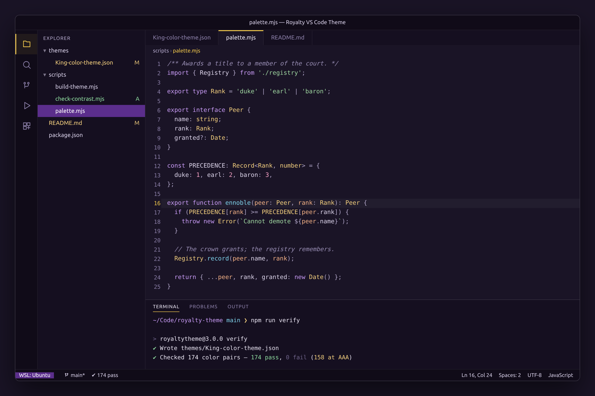
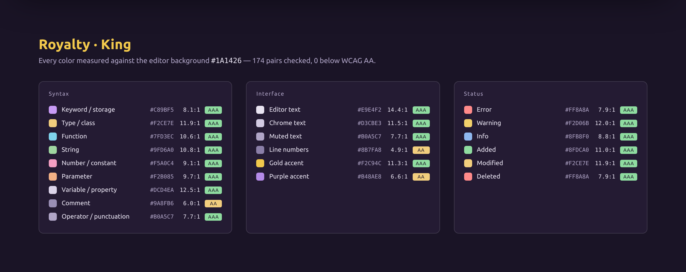
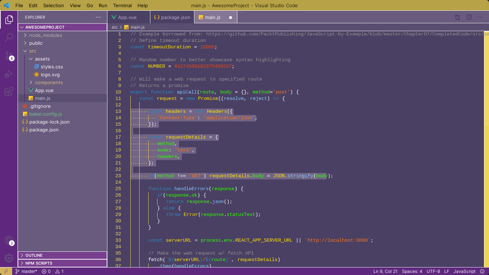

# Royalty VS Code Theme

A dark theme in purple and gold, built on a deep plum ground. Every color it ships is checked
against WCAG contrast minimums — 174 pairs, none below AA.

Available on the [Visual Studio Marketplace](https://marketplace.visualstudio.com/items?itemName=Alcash55.royaltytheme).



## Install

Search **Royalty Theme** in the Extensions view, or:

```
ext install Alcash55.royaltytheme
```

Then pick **King** from `Preferences: Color Theme` (`Ctrl+K Ctrl+T`).

## Inspiration

The colors of royalty during the 16th–19th centuries, when they signified:

- **White** — purity
- **Gold** — wealth
- **Purple** — royalty

## The palette

Purple and gold carry the theme. Cyan, sage and rose support them so the common token types stay
apart from each other without any of them shouting.



| Role | Color | Contrast on `#1A1426` |
|---|---|---|
| Editor text | `#E9E4F2` | 14.4:1 · AAA |
| Keyword, storage | `#C89BF5` | 8.1:1 · AAA |
| Type, class, interface | `#F2CE7E` | 11.9:1 · AAA |
| Function, method | `#7FD3EC` | 10.6:1 · AAA |
| String | `#9FD6A0` | 10.8:1 · AAA |
| Number, constant | `#F5A0C4` | 9.1:1 · AAA |
| Parameter | `#F2B085` | 9.7:1 · AAA |
| Variable, property | `#DCD4EA` | 12.5:1 · AAA |
| Comment | `#9A8FB6` | 6.0:1 · AA |
| Operator, punctuation | `#B0A5C7` | 7.7:1 · AAA |
| Gold accent | `#F2C94C` | 11.3:1 · AAA |
| Purple accent | `#B48AE8` | 6.6:1 · AA |

## Accessibility

`npm run check` measures every foreground against the surface it actually renders on and fails
the build if anything falls short:

- **Syntax and semantic tokens** — at least 4.5:1 against the editor background (AA for body text).
- **Interface text** — every pair checked on its own surface, not assumed against the editor:
  sidebar, tabs, status bar, menus, notifications, peek view, terminal, widgets.
- **Translucent overlays** — selection, current-line and find-match backgrounds are composited
  onto the editor background first, so text read *through* an overlay is measured as seen. This is
  what sets the floor on the comment color.
- **Icons and non-text boundaries** — at least 3:1, the AA threshold for non-text contrast.

Current result: **174 pairs checked, 0 failures, 158 at AAA.**

Deliberate exceptions, both non-text: `terminal.ansiBlack` is a background swatch rather than a
text color, and `gitDecoration.ignoredResourceForeground` is meant to recede.

## What changed in 3.0.0

The previous version put mid-tone syntax colors on a washed-out `#4a4063` background. Five of its
nine syntax colors fell below AA — keywords sat at 2.96:1 and storage types at 2.45:1, which is
roughly half the readable minimum, on two of the most common tokens in any file.

<details>
<summary>Before — version 2.2.0</summary>



</details>

- **Background dropped to a deep plum** (`#4a4063` → `#1A1426`), which is what gives every
  foreground room to reach AA.
- **Syntax palette rebuilt** off the neon green / hot pink / pure yellow mix onto a coherent set
  of six desaturated hues.
- **Gold demoted to an accent.** It used to be the line numbers, the indent guides, the whitespace
  markers, the terminal text and the title bar all at once. It is now the cursor, the active line
  number, badges and buttons.
- **Body text softened** from pure `#ffffff` to `#E9E4F2`, which glares less on a dark ground.
- **Token rules reorganized by role, not language.** 241 largely per-language rules became 43
  scope-level rules, so languages without a bespoke rule are themed properly instead of falling
  back to defaults.
- **Semantic highlighting filled in** — 31 rules, up from 3.
- **Workbench coverage widened** to 396 colors, adding bracket pair colorization, inlay hints,
  sticky scroll, peek view, notebooks, testing, merge conflicts and a full ANSI terminal palette.

## Development

The theme JSON is generated. Edit the palette, not the JSON.

```bash
npm run build     # scripts/palette.mjs -> themes/King-color-theme.json
npm run check     # WCAG contrast gate, exits non-zero on any failure
npm run verify    # build + check
npm run preview   # regenerate assets/preview.html for the screenshots
```

| File | Purpose |
|---|---|
| `scripts/palette.mjs` | Every color in the theme, in one place |
| `scripts/build-theme.mjs` | Generates the theme JSON from the palette |
| `scripts/check-contrast.mjs` | WCAG contrast gate |
| `scripts/contrast.mjs` | Dependency-free WCAG ratio helpers |
| `scripts/render-preview.mjs` | Builds the preview page the screenshots come from |

To try changes locally, press `F5` to launch an Extension Development Host, then select the King
theme inside it.

> The preview images are rendered from `themes/King-color-theme.json` itself, so they always show
> the colors the theme actually ships.

## Resources

Palette originally drafted at [coolors.co](https://coolors.co/4a4063-594e70-685b7d-857696-bfacc8-c8c6d7-a083b3-783f8e-5f287e-4f1271).
[themes.vscode.one](https://themes.vscode.one/) was the starting template for the original version.
